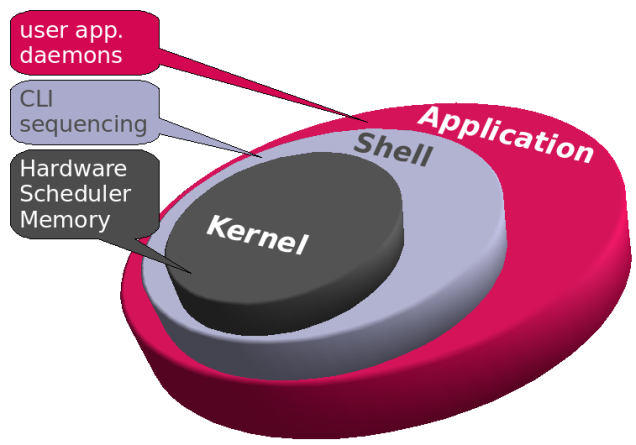
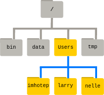

# Planejamento para o Minicurso Linux

Created: May 16, 2022 3:19 PM

## Parte 1 - Introdução

- O Unix é um sistema operacional (*operational system*, OS) multi-tarefa e multi-usuário, com uma arquitetura baseada em três níveis:
    - **Kernel:** é o núcleo do sistema responsável pelas funções internas
    - **Shell:** é a interface entre o usuário e o Kernel
    - **Aplicativos:** comandos



HIREMATH, J. **Difference between kernel and shell - Jagadish Hiremath**. Disponível em: <https://jaguhiremath62.medium.com/difference-between-kernel-and-shell-718b3de15be6>. Acesso em: 19 maio. 2022.

- Linux é um Kernel *open-source* *Unix-like*

## **Linux e Ciência**

- Razões históricas - diversos programas feitos para sistemas *Unix-like*
- Disponível para qualquer tipo de máquina
- Eficiência para arquivos de textos massivos
- Criação de programas facilitada
- Aberto e gratuito

## **Interface da Linha de Comando (*Command-line Interface*, CLI)**

- ≠ Interface Gráfica (*Graphical Interface*, GI)
- a interação com o Kernell é realizada textualmente
- fácil de automatizar
- interface simplista que usa um menor poder computacional
- flexibilidade, confiabilidade e automação

```bash
prompt comando parâmetro argumento
```

- **prompt**: usuário + ‘@’ + nome do computador + ‘:’ + diretório atual + $ (*regular user*) ou # (*root user*)


- **comando**: programa ou instrução textual que será executada
    - *built-in*: proveniente do sistema
    - externo: arquivo executável, não é proveniente do sistema
    
- **parâmetros**: descrição adicional de um comando
    - *switch* ou *flag*: exige um **argumento** qualitativo
    - option: exige um **argumento** quantitativo
    

## Ajuda com comandos

```bash
apropos keyword_1
apropos keyword_1 keyword_2
apropos "keyword_1 keyword_2"
apropos -e specific_keyword

#prática!
apropos "make directories"
```

```bash
whatis comando # resumo breve
man comando # descrição dos argumentos de forma breve
info comando # descrição dos argumentos de forma extensa
comando --help # descrição dos argumentos de forma breve, sem rolagem de página
comando -h # descrição dos argumentos de forma breve, sem rolagem de página

#prática!
whatis mkdir
man mkdir
info mkdir
mkdir --help
```

- **E FÓRUNS!**
    - alguém já pensou na sua dúvida (ou alguma semelhante)
    - saiba perguntar!
    - Overflow, Github, w3schools, CodeProject, Quora …

## Parte 2 - Trabalhando com arquivos

## Organização do sistema

- Em Unix, existem arquivos e processos
    - arquivos em Linux
        - *regular* (-)
            
            ```bash
            arquivo.txt # arquivo de texto
            arquivo.fasta # arquivo que possui sequências biológicas
            arquivo.zip # arquivo compactado
            ```
            
        - *directories* (d)
            
            ```bash
            /home # this is where user data lives
            /root # home directory of root user
            /bin # commom programs, shared by system
            /tmp # temporary space
            ```
            
        - *links* (l)
        - etc...
        
- Os arquivos são divididos em uma estrutura hierárquica e tudo está dentro do diretório *root*



- arquivos ocultos
    - `.` indica o diretório atual
    - `..` indica o diretório acima
    - `.file` arquivo oculto

- PATH
    - Caminho absoluto (*full path*), começa com / or ~/
    
    ```bash
    /home/aluno/Documentos
    ~/aluno/Documentos
    /
    /bin/ls
    ```
    
    - Caminho relativo (*relative path*), começa com os
    
    ```bash
    aluno/Documentos
    .
    ..
    ```
    

## Apresentação da questão biológica

- Dados de 16s de *Cronobacter dublinensis, C. sakazakii, C. universalis* e importância
- Armazenados em arquivos .fasta, o que são?

- mkdir, cria diretórios `mkdir atividade_pratica_cli_unix` *falar sobre nomeação de arquivos*
- cd, entra em diretórios `cd atividade_pratica_cli_unix/` *falar sobre autocomplete (TAB key)*
- ls, lista arquivos `ls` *falar sobre os parâmetros*
- pwd, mostra o caminho absoluto do diretório atual `pwd`
- cp, copia arquivos regulares (ou diretórios, recursivamente -r)
- mv, move arquivos regulares (ou renomeia)
    
    `mv /home/santosrac/Downloads/C_dublinensis_LMG23823.fasta .`
    
    `mv ~/Downloads/C_universalis_16S.fasta .`
    
    `mv ../../../../../Downloads/C_sakazakii_16S.fasta .`
    
    `mv /home/santosrac/Downloads/sequence.fasta .`
    
    `mv sequence.fasta C_dublinensis_genome.fasta`
    
- touch, cria arquivos vazios `touch empty_file`
- rm, remove arquivos regulares (ou diretórios, recursivamente -r)
    
    `rm empty_file`
    
    `mkdir dir_1`
    
    `rm dir_1`   #erro
    
    `rm -r dir_1`
    

## Parte 3 - Processamento textual

## Trabalhando com arquivos textuais

```bash
file example_file

#prática!
file C_dublinensis_LMG23823.fasta
```

```bash
wc -l # lines in text files
wc -b # bytes 
wc -w # words

#prática!
wc -l C_dublinensis_LMG23823.fasta
wc -l C_dublinensis_genome.fasta
```

```bash
head example_file
head -5 example_file
tail example_file
tail -5 example_file

#prática!
head C_dublinensis_genome.fasta
head -5 C_dublinensis_genome.fasta
head -100 C_dublinensis_genome.fasta
tail C_dublinensis_genome.fasta
tail -5 C_dublinensis_genome.fasta
tail -100 C_dublinensis_genome.fasta
```

```bash
more example_file
less example_file 

#prática!
more C_dublinensis_genome.fasta
less C_dublinensis_genome.fasta
```

```bash
grep 'occurence' example_file
grep -c 'occurence' example_file 

#prática!
grep "^>" C_dublinensis_genome.fasta
```

```bash
cat file1 file2 # concatenate
cat file # see the file

#prática!
cat C_dublinensis_LMG23823.fasta C_sakazakii_16S.fasta C_universalis_16S.fasta
```

## Parte 4 - Concatenação de processos

## Data streams

- Standard input (STDIN)
    - by default, keyboard
    - ‘ctrl + d’ to sinalize the end of input
- Standard output (STDOUT)
    - by default, screen
- Standard error (STDERR), represented by a 2
    - by default, screen

## Redirecting

> redirects to or from a file
> 
- >  redirect STDOUT to a file
- 2> redirect STDERR to a file
- >> redirect STDOUT to a file, appending
- 2>> redirect STDERR to a file, appending

```bash
cat example_file1 example_file2 > example_file3
cat > new_file

#prática!
cat C_dublinensis_LMG23823.fasta C_sakazakii_16S.fasta C_universalis_16S.fasta > 16S_Cronobacter_filogenia.fasta
```

## Piping

> redirects to or from a program
> 

```bash
ls /usr/local/bin | wc -l
# list the contents into the lib directory, send the output to the wc command, and count the number of lines
```

## Concatenação de programas

> realizar mais de um processo em uma só linha
> 

```bash
cat C_dublinensis_LMG23823.fasta C_sakazakii_16S.fasta C_universalis_16S.fasta > 16S_Cronobacter_filogenia.fasta; mkdir filogenia_Cronobacter; mv 16S_Cronobacter_filogenia.fasta filogenia_Cronobacter
```

## ~~Bônus~~

## Rodando processos em segundo plano

```bash
'ctrl + c' # kill a program running at screen
'ctrl + z' # pause the program
```

```bash
command & # running in background
```

```bash
jobs # list all jobs running in background
```

```bash
fg %2 # brings back to the foreground the job 2
bg # it runs a previous stopped program and send it to the background (most recent)
```

```bash
kill %2 # kill the job 2
kill 16289 # kill the job PID 16289
killall cat # kill all the cat jobs
```
